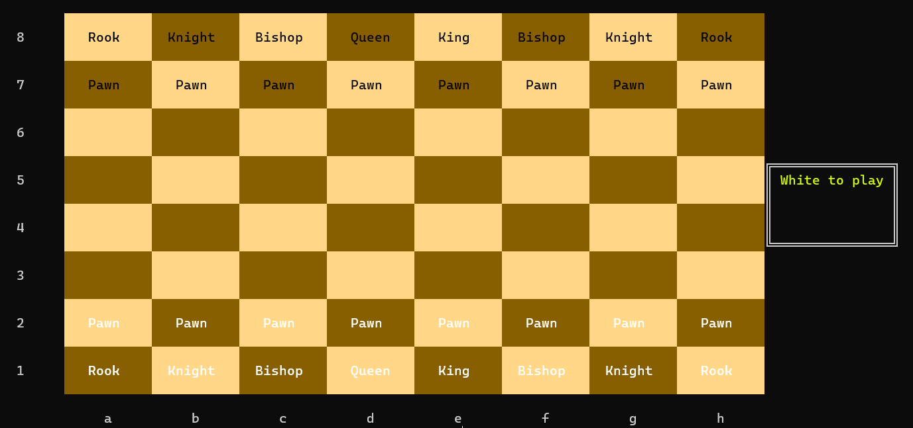
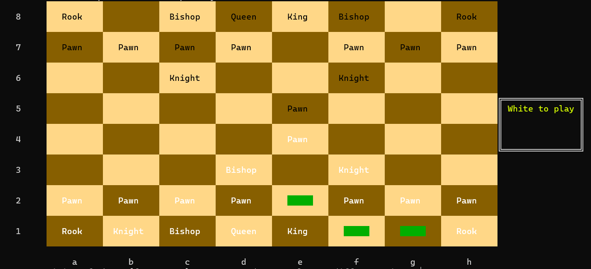
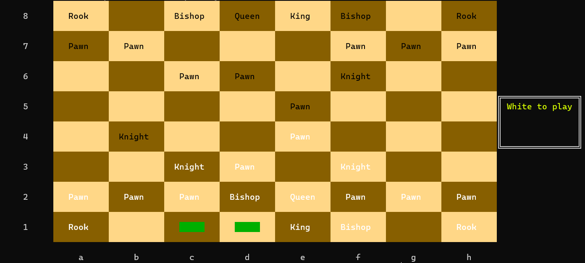
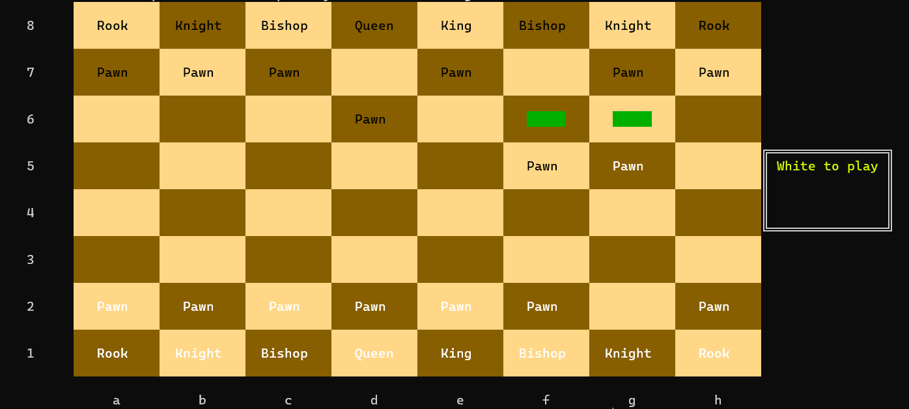
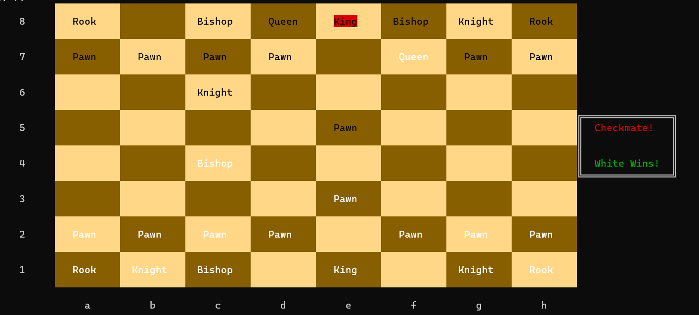

# Chess-game
A C++ chess program for two players, made with 2D arrays and OOPS concepts.

It is a simulated replica of the real-world chess game, which includes
  - En-passant
  - Pawn promotion
  - King side and Queen side Castling
  - stalemate

# How to run
**Steps**:
- 💾 Clone the repository
```bash
git clone https://github.com/AnasMaged/Chess.git
```
- 🏃‍♂️ Compile and run, Navigate to the working directory of the repository and open a Bash window then invoke the following command
```bash
g++ .\SrcFiles\*.cpp -o Chess
```

- Open Chess.exe 

# How to Play

To make a move, simply specify the row and column of the piece you want to move. Columns are defined from 'a' to 'h', and rows from '1' to '8'. For example, the squares are named like 'c2', 'e6', 'f3', and so on.


# Initial Board
<h1 align="center">
    
</h1>

# King side castle
<h1 align="center">
    
</h1>

# Queen side castle
<h1 align="center">
    
</h1>

# En Passant
<h1 align="center">
    
</h1>

# Stalemate
<h1 align="center">
    
</h1>

# Checkmate
<h1 align="center">
    
</h1>
